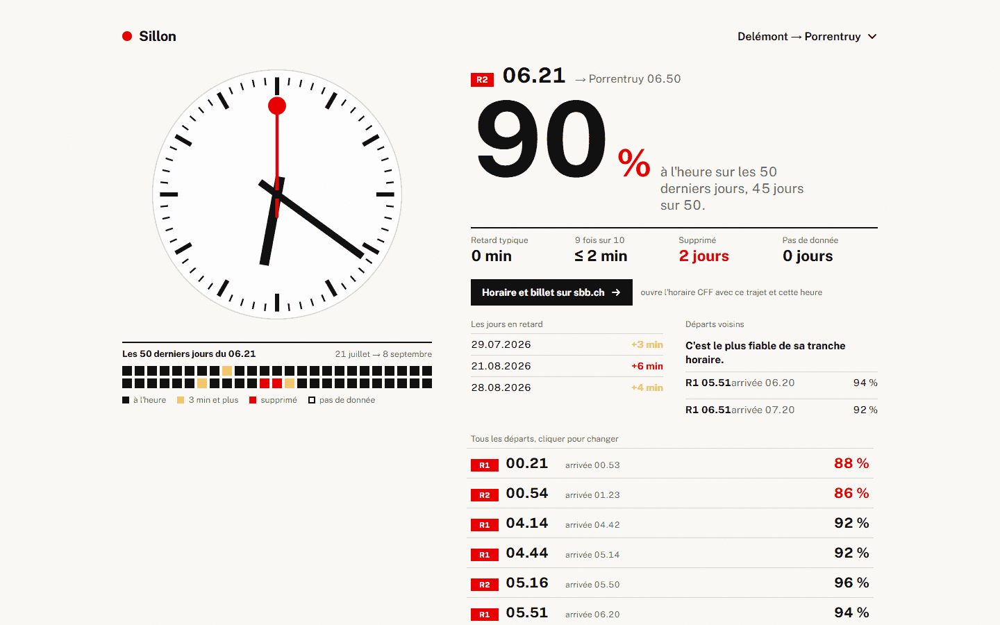
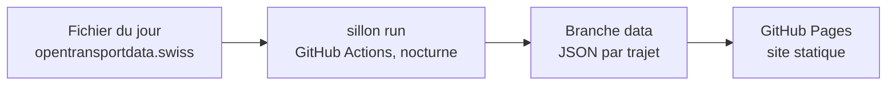

# Sillon

La fiabilité réelle de ton train, pas la moyenne du réseau.

[iniddeee.github.io/sillon](https://iniddeee.github.io/sillon/) · 



## Comment lire l'écran

Le train sélectionné est en héros : l'horloge à gauche affiche son heure de départ, ses aiguilles
bougent quand tu cliques une autre ligne dans la liste. Le gros chiffre est le taux de ponctualité
sur la fenêtre affichée : arrivée avec moins de 3 minutes de retard, la définition officielle suisse.
Sous l'horloge, une rangée de carrés, un par jour : noir = à l'heure, jaune = 3 minutes de retard ou
plus, rouge = supprimé, carré creux avec un point = pas de train ce jour-là. Sur un trajet avec
correspondance, jaune à contour rouge veut dire correspondance ratée. Le bouton noir ouvre l'horaire
CFF officiel, trajet et heure déjà remplis, pour le billet.

## D'où viennent les données

Chaque jour, opentransportdata.swiss publie un fichier Ist-Daten (v2) qui liste toutes les
circulations ferroviaires suisses de la veille, environ 660 Mo. Sillon en extrait seulement les
trajets suivis dans `config/pairs.json`. Seuls les enregistrements au statut `REAL` comptent comme
mesurés : une prévision (`PROGNOSE`) ou une donnée inconnue (`UNBEKANNT`) ne dit rien sur l'heure
réelle, donc le jour est marqué « pas de donnée », jamais ponctuel. Un train supprimé
(`FAELLT_AUS_TF`) compte contre le score.

Le portail ne garde que 50 jours glissants par fichier individuel. Sillon construit sa propre
fenêtre de 90 jours nuit après nuit ; elle a démarré à 50 le temps que les 40 suivants s'accumulent.
Le job tourne chaque nuit à 04:37 UTC, une fois le fichier de la veille disponible.

## Comment ça tourne



Zéro serveur, zéro clé API : pipeline, données publiées et site sont tous publics dans ce repo.

## Ajouter un trajet

Éditer `config/pairs.json`, un trajet direct et un avec correspondance :

```json
{ "id": "lausanne-berne", "from": { "bpuic": 8501120, "name": "Lausanne" }, "to": { "bpuic": 8507000, "name": "Berne" }, "via": null }
{ "id": "delemont-bienne-lausanne", "from": { "bpuic": 8500109, "name": "Delémont" }, "to": { "bpuic": 8501120, "name": "Lausanne" }, "via": { "bpuic": 8504300, "name": "Bienne" } }
```

Pour trouver le BPUIC d'une gare absente, chercher dans un fichier istdaten déjà téléchargé :

```
sillon stations --csv <fichier> --search Bienne
```

Le trajet apparaît sur le site après le passage nocturne suivant.

## Lancer en local

```
pip install -e .[dev]
pytest
npm ci
npm run dev
```

Les deux premières dans `pipeline/`, les deux suivantes dans `web/`. En dev, le site lit
`web/dev-data/` (un `index.json` et quelques paires d'exemple) au lieu de la branche `data`, donc
pas besoin d'avoir fait tourner le pipeline pour voir l'interface.

## Limites connues

- Changement d'horaire de décembre : un train qui se décale d'heure repart avec un historique vide,
  comme un nouveau train.
- La fenêtre grandit de 50 à 90 jours au fil des nuits ; avant 90, les stats portent sur moins de
  jours que le maximum prévu.
- Certains jours n'ont aucune donnée temps réel exploitable pour un train donné ; ils sont exclus
  du taux plutôt que comptés à tort.
- Pas de recherche libre de gare : seuls les trajets de `config/pairs.json` sont suivis.

## Données et licence

Source des données : [opentransportdata.swiss](https://opentransportdata.swiss), citée conformément
à ses [conditions d'utilisation](https://opentransportdata.swiss/en/terms-of-use/).
Code sous licence [MIT](LICENSE).
